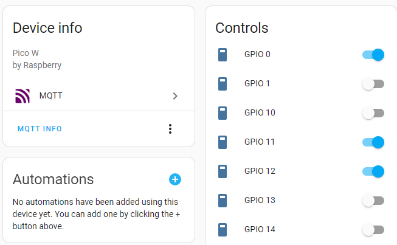

# Raspberry Pico to Home Assistant by MQTT 
Home assistant MQTT discovery to GPIO as switch entities.

`main.py` in this project acts as a bridge between Home Assistant and your Raspberry Pico's GPIO pins. It connects to an MQTT broker, listens for Home Assistant's discovery messages, and configures GPIO pins as switch entities based on these messages. It also listens for commands from Home Assistant to control the state of these GPIO pins.

## Installation
Update `secrets.py` with your WiFi and MQTT broker details.

Upload the project to your Raspberry Pico. 

## Home assistant MQTT discovery

```yaml	
platform: mqtt
device:
  name: Lego controller
  identifiers:
    - pico_1
  manufacturer: Raspberry
  model: Pico W
name: GPIO 0
payload_on: '1'
unique_id: pico_1_0
state_topic: pico/1/status/0
state_on: '1'
state:off: '0'
command_topic: pico/1/set/0
payload_off: '0'
```
## Home assistant device
